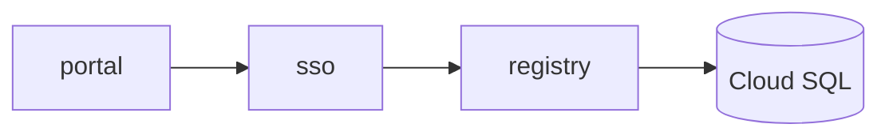

# Presenter

Write a talk in Markdown. Build it into one self-contained HTML file. Open it from a small
native macOS app that looks like a tool, not a browser tab.

**Author:** Oscar Neira · MIT licensed

---

## Why

Slide software makes you fight the layout before you have the argument. Writing slides as
Markdown means the words come first, the design is a stylesheet you set once, and the whole
deck diffs in git like anything else.

And because a deck is a plain text file, an AI can draft one, revise one, or review one the
same way it would any other document. That is the point of the format, not a bolt-on.

Three things this gives you that a normal reveal.js setup does not:

- **One file output.** `deck.html` inlines reveal, the theme, and the slides. No server, no
  localhost, no network. Double-click it, present from a borrowed laptop, email it.
- **A launcher.** A 320 KB native app that lists your decks and opens them full-screen with
  no URL bar.
- **A checker.** `npm run check` drives the built deck in a real browser and fails on the
  two things a source review never catches: a slide clipped by the frame, and an SVG whose
  content falls outside its own viewBox.

## Install

```bash
git clone <this repo> ~/Documents/projects/presenter
cd ~/Documents/projects/presenter/app
./build.sh
cp -R Presenter.app /Applications/
```

Drag it to the Dock once. Requires macOS 13+ and Xcode command line tools.

## Make a deck

```bash
./new-deck.sh "Q3 planning"
```

Creates `~/Documents/presentations/2026-01-01-q3-planning/`, installs reveal, builds it, and
it appears in Presenter (press ⌘R).

Then:

```bash
cd ~/Documents/presentations/2026-01-01-q3-planning
$EDITOR slides.md
./build.sh          # rebuild deck.html
npm run check       # verify it before you present it
```

## Writing slides

`slides.md` is plain Markdown. `---` on its own line separates slides. Anything after
`Note:` is speaker notes, visible only in the presenter view (**S**).

| Markup | Renders as | Use for |
|---|---|---|
| `> quote` | Serif italic | The quoted or aspirational voice: a brief, a mock, a PRD |
| `` `code` `` | Mono, accent | The working voice: parts, owners, states |
| `<p class="eyebrow">` | Mono caps with a rule | The label above a headline |
| `<p class="kicker">` | Mono, accent left border | The one line to say out loud |
| `<p class="note">` | Small grey mono | A quiet footnote |
| `<span class="s-run">` / `s-risk` / `s-none` | Green / amber / accent chip | Status in tables |
| `<div class="cols">` | Auto-fit columns | Two or three way splits |
| `<!-- .slide: class="dense" -->` | Scales that slide down | A slide with a long list |
| `<!-- .slide: class="map" -->` | First table column leads | Tables whose column one is the subject, not an index |
| `<!-- .slide: class="visual" -->` | Shrinks supporting text | A slide the picture carries |

**The one design idea worth keeping:** the typeface changes when the argument changes.
Serif for the aspirational voice, mono for the working voice, sans for statements. Readers
feel the shift without you explaining it.

## Diagrams

Two kinds, and they are not interchangeable.

**Mermaid, for structure.** Flowcharts, sequences, state, ER. Fast to write, consistent, and
easy to change when the architecture does.

````markdown

````

`build.sh` renders these to inline SVG at build time, so the deck still ships as one file
with no runtime JavaScript. Mermaid colours are bound to the theme's CSS variables, so
diagrams follow light and dark without being re-rendered.

**Hand-written SVG, for illustration.** Anything that is an idea rather than a structure — a
gauge, an exploded object, a metaphor. Mermaid cannot draw those and should not try.

Two rules for hand-written SVG, both learned the hard way:

1. **No blank lines inside the `<svg>` block.** Markdown exits HTML mode and renders the
   rest of the slide as a code block.
2. **Keep every coordinate inside the viewBox.** An arc apex above `y=0` is silently
   cropped and looks like a rendering bug.

`npm run check` catches both.

## Presenting

| Key | Does |
|---|---|
| `→` `←` | Next / previous |
| **S** | Speaker view: notes, timer, next slide (a second window) |
| **O** | Overview of all slides |
| **B** | Black the screen, for discussion |
| **⌃⌘F** | Full screen |
| **⌘[** | Back to the library |
| **⌘R** | Reload after a rebuild |

## Export a PDF

```bash
node tools/pdf.js path/to/deck.html out.pdf
```

Or open `deck.html?print-pdf` in a browser and print, margins none, background graphics on.

## Layout

```
app/          the macOS launcher (Swift + WebKit, no Electron)
template/     what new-deck.sh copies: slides.md, theme.css, build.sh, check.js
docs/         conventions and notes
new-deck.sh   scaffold a deck into ~/Documents/presentations
```

## Theming

Every colour is a CSS custom property at the top of `theme.css`. Replace the values in
`:root` and the deck follows, including both themes. Keep one accent and spend it sparingly.

Contrast matters more than it looks like it does: anything below **3:1** against the
background disappears on a projector. Graphic strokes use a dedicated `--stroke` token for
exactly this reason.
